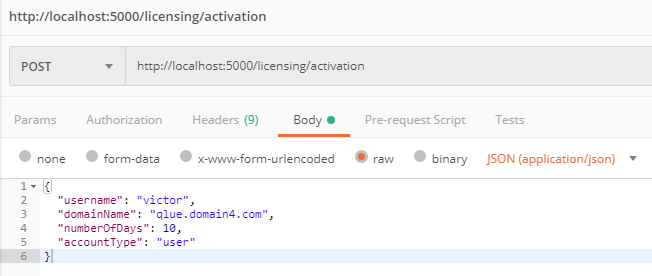
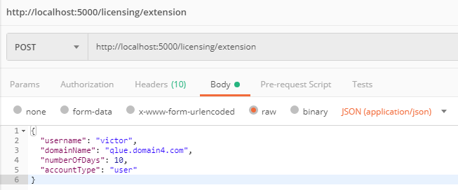
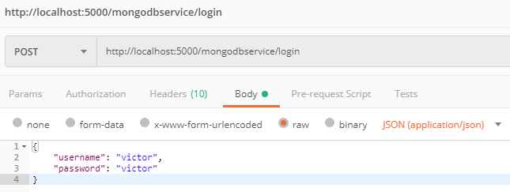

# viscient-licensing-python-flask
Viscient Licensing BackEnd with Python Flask, Flask RESTplus and PyMongo

## Getting Started
Naviagate your with target terminal to the root directory of the project.
Using Windows CMD/PowerShell command the following.

`[PowerShell]` Activate to Virtual Environment:
```
./venv/scripts/activate.ps1
```

`[CMD]`
Activate to Virtual Environment:
```
cd venv/scripts/ & activate.bat
```

Using pip to install all of the requirements:
```
pip install -r requirements.txt
```

Run the project:
```
flask run
```

Navigate to the project in your browser, by default its running on port 5000:
```
http://localhost:5000/
```

To deactivate Virtual Environment, simply run the following command in any directory:
```
deactivate
```

## Why using Virtual Environment with Flask?
To manage dependencies accross multiple project. Without Virtual Environment, PIP would install all of the modules in the requirements globally. When another project comes in or require a module update, it might break its compability since its module is shared. For example, this project uses Jinja2 version 2.10.1, and when another project update Jija2 version 3.0.0, it might not be compatible with the current project, whether its new syntax or depraciation.

## Project Structure
The project structure is very simple, since we are managing a small scale application, and that is where Flask excels in. Everything is contained in `app.py`, from its constant, logic, endpoints, etc. Because it's 1 file with almost 500 lines of code, the project is divided into the following section:
 1. Module imports
 1. Constants
 1. Configurations
 1. Models
 1. Custom Decorators
 1. Licensing Endpoints
 1. MongoDb Endpoints
 1. Helper methods

Each section is labelled like so inside `app.py`. Commenting inside the code too much would prevent readibility. Simultaneously, this documentation is also structured like so. Should the project grows any further with more and more endpoints, it would be wise to separate these components based on the above structure.

## Module imports
All of the required module can be found in requirements.txt. The major modules/libraries here are `flask`, `flask_restplus`, `flask_pymongo` and `mailjet_rest`. The rest are purely for utility purposes. Flask is the microframework that makes REST API. Flask RESTplus is an extension of Flask to generate a Swagger interface that is useful to debug on its own, not to mention that it provides heaps of utilities that makes it a "self-documented API". Flask PyMongo is used as an adapter for MongoDb. While MailJet_REST is the proxy email tool to send an automated email notification. 

## Constants
There are 5 constant variables define in these project. These are important and sensitive information for the foundation of the BackEnd system:
 1. Mongo URI. The connection string for MongoDb.
 1. API Key. The key used by BackEnd and FrontEnd to communicate.
 1. Viscient API URL. The base Licensing API URL for Viscient.
 1. MailJet API Key. Utilised as MailJet username/identifier.
 1. MailJet API Secret. Utilised as MailJet password.
 
Please refer to `app.py` for each of its value.

## Configurations
This is the section where we instantiate all the necessary variables and setup before running the web app. It's mostly Flask syntax and pretty self explanatory from the code itself.

## Models
Models are used as the expected payload for any of the POST request. We can also specify whether any fields are mandatory or not.

## Custom Decorators
There is only 1 custom decorator, called `token_required`. This is a paramount decorator to put on top of any GET/POST method, since this is the main security in the BackEnd that does the check whether any request headers contain the API Key or is empty. Also note that this decorator method is above any of the endpoint method, else Python won't recognise the decorator.


## Licensing Endpoints
### GET / query_licensing
`query_licensing` endpoint is used to query target user's amount of License or Credit from the base Viscient Licensing service. It simply query and read its `results.data.license` or `results.data.credit` and return it as license/credit for FrontEnd

Expected params:

`username = string`

Example usage:
```
http://localhost:5000/licensing/query_licensing?username=username123
```

Example return objects:
```
{
    "status_code": 200,
    "license": {
        "VAppLPR": 50,
        "VAppStreamerWS": 50,
        "VBrainObject": 50,
        "VAppTrafficIntensity": 0,
        "VAppStreamerTornado": 50,
        "VAppIllegalPark": 50,
        "VAppCounter": 50,
        "VAppFP": 100,
        "VAppPeopleCounter": 0,
        "VAppAnalyticsTornado": 50,
        "VAppStreamerEventPush": 50
    },
    "credit": {
        "VAppLPR": 0,
        "VAppStreamerWS": 0,
        "VBrainObject": 0,
        "VAppTrafficIntensity": 0,
        "VAppStreamerTornado": 0,
        "VAppIllegalPark": 0,
        "VAppCounter": 0,
        "VAppFP": 0,
        "VAppPeopleCounter": 0,
        "VAppAnalyticsTornado": 0,
        "VAppStreamerEventPush": 0
    }
}
```

### POST / activation
`activation` endpoint does the following:
 1. Activating a domain by talking to the base Viscient API based on the supplied parameters.
 1. Once successful, it inserts a new row of history to MongoDb with `insert_history` method.
 1. Followed by decrementing the user's credit (if user is not `admin`) in MongoDb with `inc_poc_license` method.
 1. It sends an notification email with `send_email_mailjet` method.
 1. Returns success objects.

Expected params:
```
{
    "username": "victor",
    "domainName": "qlue.domain4.com",
    "numberOfDays": 10,
    "accountType": "user"
}
```

Example usage via Postman:



Example return objects:
```
{
    "status_code": 200,
    "message": "Success",
    "insertResponse": 200,
    "decrementResponse": 200,
    "email_notification_response": 200
}
```

### POST / extension
`extension` endpoint does the exact same thing with `activation`. The only difference is that extension hits different endpoint in base Viscient API and its `action_type` is written as `Extension POC` in history.

Expected params:
```
{
    "username": "victor",
    "domainName": "qlue.domain4.com",
    "numberOfDays": 10,
    "accountType": "user"
}
```

Example usage via Postman:



Example return objects:
```
{
    "status_code": 200,
    "message": "Success",
    "insertResponse": 200,
    "decrementResponse": 200,
    "email_notification_response": 200
}
```
## MongoDb Endpoints
### POST / login
`login` endpoint simply checks and compare username and password from MongoDb. If no username and password found in the database, it returns `404` status code which the front end could perceive is as `Invalid username/passoword`. The only useful payload in the return statement is the `account_type` derived from the database. This would be utilised to determine whether the user is an `admin` or plain `user`.

Expected params:
```
{
    "username": "victor",
    "password": "victor"
}
```

Example usage via Postman:



Example return objects:
```
{
    "username": "victor",
    "status_code": 200,
    "message": "User found",
    "accountType": "user"
}
```

### GET / history
`history` endpoint retrieves all the history for a particular user or all history if the user is an admin. It returns `404` status code when no user found (which should never be the case). Before returning the result of the object, the datetime found in the collection needs to be formatted. By default any date stored inside MongoDb is stored as `UNIX Epoch Time` i.e. `1557705605` translates to `May 13 2019 00:00:05`. The datetime needs to be converted, simply with `.isoformat()` method. This data is then updated into `history_details` variable and returned. 

Expected params:

`username = string`
`accountType = string`

Example usage:
```
http://localhost:5000/mongodbservice/history?username=victor&accountType=user
```

Example return objects:
```
{
    "history_details": [
        {
            "_id": {
                "$oid": "5cd951d6c3b6377ef2f47530"
            },
            "username": "victor",
            "actionType": "Activate POC",
            "domainName": "qlue.domain4.com",
            "dateCreated": "2019-05-13T11:15:34.364000",
            "dateExpired": "2019-05-23T11:15:34.364000"
        },
        {
            "_id": {
                "$oid": "5cd562269103c483e1020449"
            },
            "username": "victor",
            "actionType": "Extend POC",
            "domainName": "vision-domain2.com",
            "dateCreated": "2019-05-10T11:36:06.884000",
            "dateExpired": "2019-05-20T11:36:06.884000"
        }
    ],
    "status_code": 200
}
```

### GET / user_counter
`user_counter` endpoint simply fetch user's POC credit based on their username found in MongoDb and return it.

Expected params:

`username = string`

Example usage:
```
http://localhost:5000/mongodbservice/user_counter?username=victor
```

Example return objects:
```
{
    "username": "victor",
    "status_code": 200,
    "message": "User found along with its counter",
    "poc_counter": 5
}
```

### GET / all_user
`all_user` endpoint simply fetch all users with accountType as `user`, along with its POC counter. Since we are fetching the data from the `credentials` collection, there are sensitive information like password that we do not wish to return as the returned object. Hence, a simple `for` loop exists to delete the the password field in the JSON array objects.

Expected params: `None`

Example usage:
```
http://localhost:5000/mongodbservice/all_user
```

Example return objects:
```
{
    "user_details": [
        {
            "_id": {
                "$oid": "5cb42e981c9d440000bcb862"
            },
            "username": "victor",
            "accountType": "user",
            "pocLicenseCounter": 1
        },
        {
            "_id": {
                "$oid": "5cbe7f581c9d44000085436c"
            },
            "username": "arnold",
            "accountType": "user",
            "pocLicenseCounter": 5
        }
    ],
    "status_code": 200
}
```